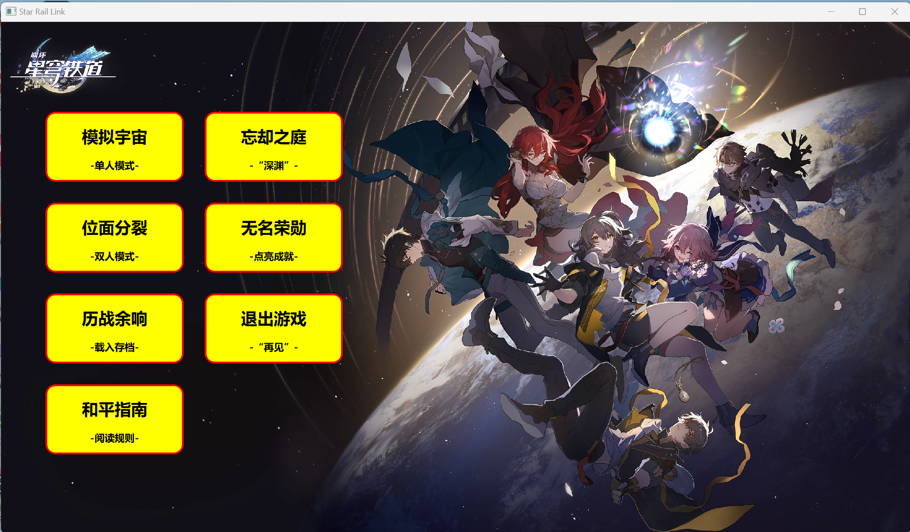

QLink连连看（星穹铁道主题），SJTU SEP暑期满分大作业，使用QT Creator开发

简单易懂，注释齐全，可供借鉴，请勿抄袭~


规则介绍：

```
QString s =     "角色出现在地图上的随机位置，控制角色在地图的空地上移动\n"
                "单人模式下，WSAD键分别对应上下左右移动\n"
                "双人模式下，WSAD键对应玩家1的上下左右移动，↑↓←→键对应玩家2的上下左右移动\n"
                "角色位于方块旁且再次向方块方向移动，会激活该方块\n"
                "若激活的两个方块相同，且能用弯折两次以内的折线连接，即可消除方块，获得分数\n\n"
                "道具定时随机出现在地图的空地上，地图上最多同时有两个道具\n"
                "接近道具即可收集道具，收集之后才能使用\n"
                "单人模式下，按1、2、3、4键，使用续时、重组、提示、瞬移道具\n"
                "双人模式下，玩家1按1、2、3、4、5键，使用续时、重组、提示、冻结、眩晕道具\n"
                "玩家2则是按6、7、8、9、0键\n\n"
                "道具介绍：\n"
                "续时：延长剩余时间30s\n"
                "重排：所有方块位置重排\n"
                "提示：10s内会高亮一对可能链接的方块，被消除后会高亮下一对\n"
                "瞬移：5s内允许通过鼠标单击来移动角色位置，如果点击到空地则角色可以移动到该位置。\n"
                "如果点击到方块且角色可以移动到该方块旁，则角色移动到该方块旁，同时方块被激活\n"
                "冻结：对手3s内无法移动\n"
                "眩晕：对手10s内移动方向颠倒（上下左右颠倒）\n\n"
                "在单人模式，如果感觉难度太大，可以接受来自黑塔的援助\n"
                "一个叫银狼的黑客骇入了模拟宇宙，植入了能修改模拟宇宙参数的病毒\n"
                "你可以选择接受她的挑战，这能尽快定位和消灭病毒\n"
                "援助和挑战都最多只能选择一个，都不选也会以正常模式进入游戏\n\n"
                "在游戏中暂停时，可以选择保存，读取之前保存的存档，以及继续游戏\n"
                "最多只能同时存在一个存档，请谨慎存档\n"
                "使用“历战余响”，可以读取你之前保存的关卡\n\n"
                "“忘却之庭”是具有挑战性的模式，初始进入时位于“深渊”的第一层\n"
                "通关后选择再来一局，会进入下一层\n"
                "失败后选择再来一局，会重新挑战这一层\n"
                "难度会逐层提升，进入新的一层时，会随机增加四类debuff之一，\n"
                "分别为时间上限增加，地图长度增加，宽度增加，道具掉落减少\n"
                "试试看你能到达第几层？\n\n"
```


游戏内截图：

<div align="center">
    
    
    
</div>


走过路过点个star再走呗！